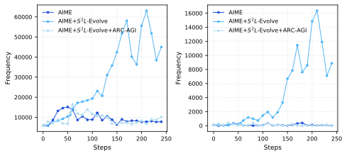
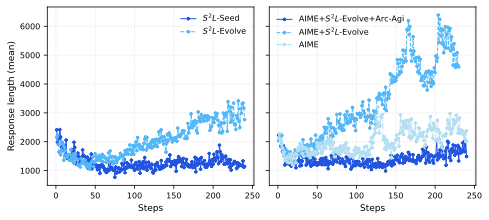
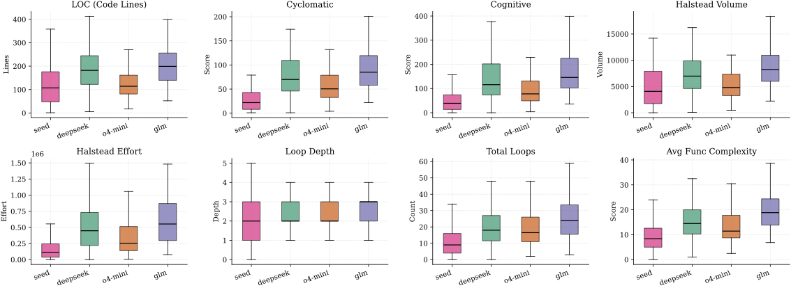
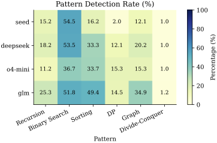

# Scaling the Scaling Logic

[](https://arxiv.org/abs/2602.13218)
[](https://github.com/AdAstraAbyssoque/Scaling-the-Scaling-Logic/)
[](https://opensource.org/licenses/Apache-2.0)
[](https://www.python.org/downloads/)
[](https://github.com/your-username/sslogic)

> **Scaling the Scaling Logic: Agentic Meta-Synthesis of Logic Reasoning**

**SSLogic** represents a paradigm shift from manual data curation to **agentic meta-synthesis**. Instead of merely generating static question-answer pairs, SSLogic synthesizes and evolves **executable programs** (Generators and Validators) that define entire families of logical tasks. This approach enables scalable data generation, controllable difficulty, and rigorous verifiability.

<p align="center">
  
  <br>
  <em>Figure 1: From Manual Curation to Agentic Meta-Synthesis. SSLogic evolves task families through a closed Generate–Validate–Repair loop.</em>
</p>

---

## Overview

Scaling verifiable training signals remains a key bottleneck for Reinforcement Learning from Verifiable Rewards (RLVR). SSLogic addresses this by moving beyond instance-level synthesis: it **iteratively synthesizes and repairs executable Generator–Validator program pairs**, allowing logical task families to evolve through a closed **Generate–Validate–Repair** loop.

Starting from **400 seed families**, SSLogic expands through two rounds of evolution to **953 task families** and **21,389 verifiable instances** (from **5,718**), while maintaining reliability through a **Multi-Gate Validation Protocol**.

## Key Features

- **Agentic Meta-Synthesis**: Moves from instance-level generation to **task-family synthesis**. Agents write executable Python programs that generate entire distributions of logic tasks.
- **Multi-Gate Validation Protocol**:
  - **Multi-Strategy Consistency Checks**: Multiple validation strategies reduce evaluator bias.
  - **Adversarial Blind Review**: Independent agents must solve generated instances strictly from the task description.
- **Closed-Loop Repair**: Failed candidates are not discarded immediately; they receive structured error logs and are iteratively repaired.
- **Controllable Evolution**: Task families can be expanded while preserving verifiability and increasing algorithmic depth.

## Performance & Impact

Training on **SSLogic-evolved** data yields consistent gains over seed-only baselines at matched optimization steps.

| Metric               | Seed Baseline | **SSLogic Evolved** | Gain      |
| :------------------- | :-----------: | :-----------------: | :-------- |
| **SynLogic**         |     14.6      |   **19.8**          | **+5.2**  |
| **BBEH**             |      —        |   **Improved**      | **+1.4**  |
| **AIME25**           |      —        |   **Improved**      | **+3.0**  |
| **Brumo25**          |      —        |   **Improved**      | **+3.7**  |

> _Reported gains are taken from the paper abstract / project summary on arXiv._

<details>
<summary><strong>View Training Dynamics (Click to Expand)</strong></summary>

### Evolution of Reasoning

SSLogic training drives the model toward longer reasoning chains and deeper self-reflection.

|                                                                              |                                                                            |
| :--------------------------------------------------------------------------: | :------------------------------------------------------------------------: |
|  |  |
|                           **Reflection Frequency**                           |                            **Response Length**                             |

</details>

## Methodology

SSLogic operates in a **Generate–Validate–Repair** closed loop:

1. **Synthesis**  
   An agent generates a `Generator` (for creating instances) and a `Validator` (for checking answers).

2. **Gated Validation**  
   - **Gate 1**: Program quality and consistency checks  
   - **Gate 2**: Adversarial blind review — can an independent agent solve the task strictly from the written description?

3. **Feedback-Driven Repair**  
   If validation fails, the agent receives structured execution / review feedback and attempts to patch the code.

<p align="center">
  
  <br>
  <em>Figure 2: Code-level complexity analysis showing increased algorithmic depth in evolved tasks.</em>
</p>

## Installation

### Prerequisites

- Python 3.9+
- [uv](https://github.com/astral-sh/uv) (recommended) or pip

### Setup

```bash
git clone https://github.com/your-username/sslogic.git
cd sslogic

uv sync
````

## Quick Start

The main entry point for the pipeline is `scripts/run_pipeline.py`.

### 1. Evolve a Seed Idea

Generate a new verifiable task family from a simple text description.

```bash
uv run scripts/run_pipeline.py \
    --seed "Calculate the sum of two numbers where one is double the other, subject to a modulo constraint." \
    --max-iterations 3 \
    --output-dir artifacts/my_experiment
```

### 2. Run from a Seed File

Process a batch of seed ideas defined in a JSONL file.

```bash
uv run scripts/run_pipeline.py \
    --seed-file data/seeds.jsonl \
    --seed-key "question" \
    --max-iterations 5
```

## Project Structure

```text
sslogic/
├── artifacts/             # Generated task families (code & data)
├── eval/                  # Evaluation harness
├── figures/               # Paper figures & visuals
├── scripts/               # Utility scripts
│   └── run_pipeline.py    # Main pipeline entry point
├── src/
│   └── sslogic/           # Core package
│       ├── pipeline/
│       └── ck_pro/
├── LICENSE
└── pyproject.toml
```

## Algorithmic Coverage

SSLogic evolves tasks covering a wide range of algorithmic patterns, shifting the distribution from simple linear logic toward more complex graph, search, and dynamic-programming-style reasoning problems.

<p align="center">
  
  <br>
  <em>Figure 3: Algorithmic Pattern Coverage.</em>
</p>

## Citation

If you find **SSLogic** useful for your research, please cite:

```bibtex
@article{liu2026sslogic,
  title   = {Scaling the Scaling Logic: Agentic Meta-Synthesis of Logic Reasoning},
  author  = {Bowen Liu and Zhi Wu and Runquan Xie and Zhanhui Kang and Jia Li},
  journal = {arXiv preprint arXiv:2602.13218},
  year    = {2026},
  doi     = {10.48550/arXiv.2602.13218},
  url     = {https://arxiv.org/abs/2602.13218}
}
```

## Links

* **Paper**: [arXiv:2602.13218](https://arxiv.org/abs/2602.13218)
* **DOI**: [10.48550/arXiv.2602.13218](https://doi.org/10.48550/arXiv.2602.13218)
* **Code**: [GitHub Repository](https://github.com/your-username/sslogic)

## License

This project is licensed under the [Apache License 2.0](LICENSE).

